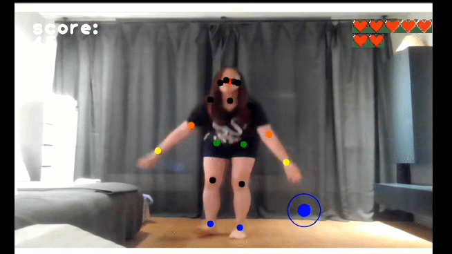

# MomchigiBakchigi

Most of the motion games on the market require players to purchase extra devices such as motion controllers and sensors. However, just one PC with a webcam is enough if the motion sensor is replaced by pose estimation algorithm. 

We developed a webcam-based rhythm game in which players use their body to dance to the music they choose. For each song or difficulty, different patterns of circles will show up on the monitor. Then, the players' body points reflected on the monitor should tap the shinking circles at a specific location and time in order to score points. 

We used (Original Repo: https://github.com/ildoonet/tf-pose-estimation) as our base architecture.

Demo:  

## Install

See [install.md](./etcs/install.md)

## File Description
| File | Description |
|:--   |:--   |
|Rythmgame.py | Proceeds the game by capturing motion and scoring points. |
|run_webcam.py | Main function that controls the overall game flow. |
|utils.py | Functions for game settings. |
|sunset_glow.xlsx | Excel file with game patterns we set. |
